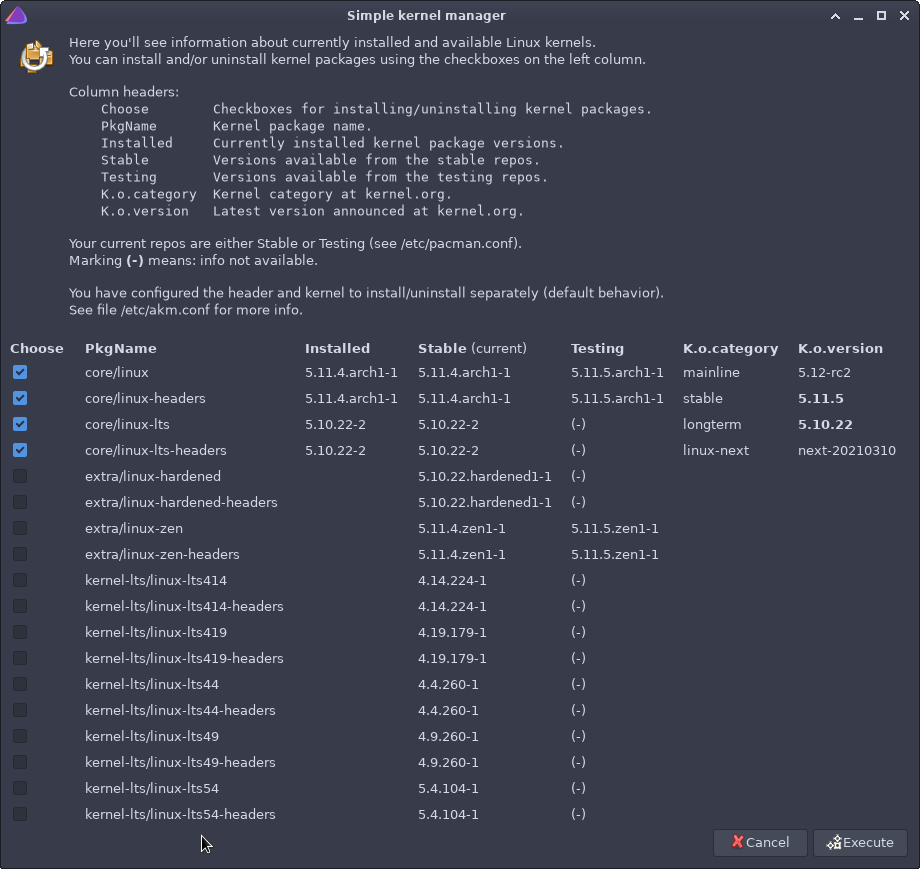

# akm
Simple kernel manager for EndeavourOS and Arch.<br>
Note: does not support kernels in AUR.


## Usage
```
akm [--connect-header | --scroll]

where
    --connect-header    Tie the header package to the kernel package when installing/uninstalling.
    --scroll            Enable scrolling in the kernel info window.
```
## Options

Without options, `akm` installs selected packages and uninstalls unselected packages.<br>
<br>
If option `--connect-header` is used, then `akm` ties kernel and header package into one atomic "unit" when installing or uninstalling.<br>
If selections of a kernel and its header conflict, kernel selection is used for both packages.
For example, if you only choose to install package `linux-zen` but not its header, option `--connect-header` would cause installing `linux-zen-headers` too.

Option `--scroll` may be useful when using kernels from additional repositories.

## Configuration file

Configuration file `/etc/akm.conf` manages how `akm` works.<br>
Currently the supported configurations are:

Variable | Description | Supported values
:--- | :--- | :---
KERNEL_HEADER_WITH_KERNEL | Tie header package with the kernel package. Does the same as option `--connect-header`. | "no" (=default) and "yes"

<br>

## Advanced example: add a new (unofficial) package repository

You can add more (unofficial) package repositories into `/etc/pacman.conf`.<br>
If the repository contains linux kernel packages, `akm` tries to add them to the list.

The picture below shows `akm` window after adding the following unofficial repo:
```
[kernel-lts]
Server = https://repo.m2x.dev/current/$repo/$arch
```

<br>


