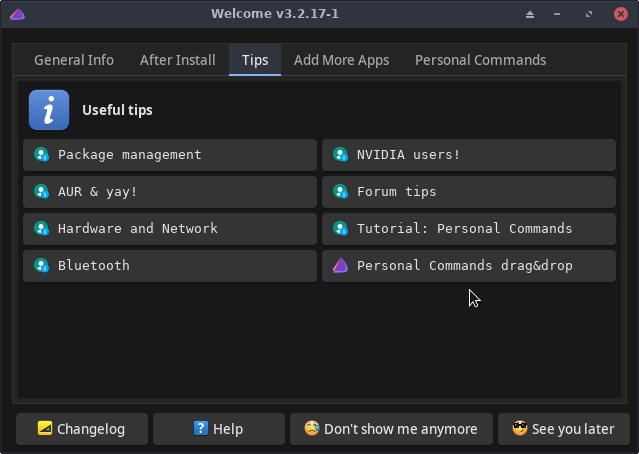
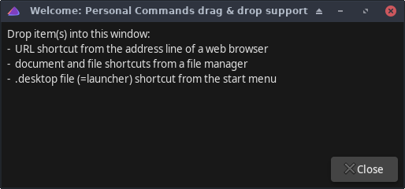

**Table of Contents**

- [Personalizing Welcome](#Personalizing%20Welcome)
  - [Overview](#Overview)
  - [Command syntax](#Command%20syntax)
    - [The **name** element and aligning](#The%20**name**%20element%20and%20aligning)
  - [Example](#Example)
  - [Example (advanced, assumes knowledge about bash language)](#Example%20(advanced,%20assumes%20knowledge%20about%20bash%20language))
  - [Example: field to run commands in terminal with `RunInTerminal`](#Example:%20field%20to%20run%20commands%20in%20terminal%20with%20`RunInTerminal`)
  - [Drag & drop items into the configuration file!](#Drag%20&%20drop%20items%20into%20the%20configuration%20file!)
  - [New simpler API](#New%20simpler%20API)
    - [Parameters for `personal_commands_init`](#Parameters%20for%20`personal_commands_init`)
    - [Parameters for `personal_commands_add`](#Parameters%20for%20`personal_commands_add`)
    - [Example: using the new API](#Example:%20using%20the%20new%20API)

# Personalizing Welcome

## Overview
You can personalize Welcome by adding new command buttons in the Welcome app. They will appear under tab **Personal Commands**.<br>
To personalize Welcome, add your new commands into file
```
$HOME/.config/welcome-own-cmds.conf
```

## Command syntax
The Welcome app uses **yad forms** and bash language to create a simple GUI.
<br>
<sup>Note that you don't need to be familiar with yad nor bash (but it may help!) to add your own commands.
Simply follow this short tutorial.<br>
(More info with terminal commands: `man yad`, `man bash`).
</sup>

Let's start with a simple Firefox example (this already works for Welcome!):
```
local welcome_own_commands=(
    --field=" Firefox web browser!!":fbtn "firefox"
)
```
You will add commands to Welcome by adding <u>yad form fields</u> to a bash array variable named
```
  welcome_own_commands
```
This variable (and possible other variables in this file) <u>should</u> be marked as a *local* variable in bash.<br>

Buttons for Welcome are defined using specially crafted *fields*. Each field defines a command for a button, for example:
```
    --field=" Firefox web browser!firefox-default!Browse the web with Firefox":fbtn  "firefox"
```

A field definition consists of the following *elements*:

Element | Purpose | Value in the example above
:--- | :--- | :---
name | button name | Firefox web browser
icon | name of an icon on the button (optional) | firefox-default
description | useful info for the user (optional) | Browse the web with Firefox
command string | actual command the button executes (can have parameters) | firefox

As you see, yad (together with bash) wants the field to be in a specific format.<br>
Between `--field=` and `:fbtn` you'll write most of the button information.
The name, icon, and description are separated with exclamation (!) marks.<br>
And because the added strings may contain space characters, always use quotes ("a string") around the strings.

<sup>*Tip*: to find useful icon names you can use e.g. command **yad-icon-browser**. It is included in the yad package.</sup><br>
<sup>*Tip (advanced)*: the command string can be e.g. a bash function with parameters (see the examples below).
</sup><br>
<sup>*Tip (more advanced)*: take a look at file /usr/bin/eos-welcome about using bash functions in the command strings.
</sup>

### The **name** element and aligning

Older versions of the `yad` program didn't support aligning text properly on buttons, so we used `_align(text)` marking for the text.<br>
This is no more needed, but you may see old definitions using it, and it can be ignored and/or safely removed.

An example field about the parameters (using the obsolete _align() marking) in the command string:
```
    # _align() is no more required
    --field="_align(EndeavourOS forum)!web-browser!Discussions at the EndeavourOS forum":fbtn
            "xdg-open https://forum.endeavouros.com"
```

Other supported (but optional) variables are
- `activate_own_commands_tab`: specifies whether the active tab in Welcome is your personal commands (instead of Welcome's default) when Welcome is started.
- `columns_for_own_commands`: specifies the layout (specifically: number of columns) of the buttons under the Personal Commands tab. Note: the layout is managed by **yad** and may *not* contain exactly the specified number of columns!
- `show_predefined_buttons_at_own_commands`: specifies whether to show (yes) or not (no) the two predefined buttons as the first buttons of the Personal Commands tab.
Note that the same two buttons exist on the **Tips** tab.

For example:
```
local activate_own_commands_tab=yes               # "yes" or "no" (default: no)
local columns_for_own_commands=4                  # a small positive number (default: 2)
local show_predefined_buttons_at_own_commands=no  # "yes" or "no" (default:yes)
```


## Example
Here is a full *example* file containing three commands/buttons, and activating personal commands tab when starting Welcome:
```
#!/bin/bash

# Contents of file $HOME/.config/welcome-own-cmds.conf.

# Own commands:
# - Create a local array variable 'welcome_own_commands'.
# - Add yad form fields as in the example below.
# - To have own commands activated initially, set local variable 'activate_own_commands_tab' to "yes";
#   otherwise the default tab is initially active.
# - Layout: specify the number of columns for the buttons on the Personal Commands tab.

local welcome_own_commands=(
    # Legend: --field=" name!icon!description":fbtn "command"

    --field=" A Kernel Manager!system-software-install!Simple kernel manager and info source":fbtn  "akm"
    --field=" Mousepad!accessories-text-editor!Mousepad text editor":fbtn                           "mousepad"
    --field=" Firefox web browser!firefox-default!Browse the web with Firefox":fbtn                 "firefox"
)

local activate_own_commands_tab=yes
local columns_for_own_commands=2
local show_predefined_buttons_at_own_commands=no
```

## Example (advanced, assumes knowledge about bash language)

This example shows how to use bash functions in the command string.<br>
After writing your bash function, there are two "additional" things to remember:
- export your bash function with: `export -f`
- command string structure changes to: `"bash -c 'MyBashFunction parameters'"`
```

Install_with_pacman() {
    # This bash function installs one or more given packages. Does not reinstall any packages.

    local yadcmd="eos_yad --text-info --title=Installer --wrap --tail --width=600 --height=500 --button=yad-quit:0"
    local pkg pkgs=()

    # Check if given package(s) are already installed:
    for pkg in "$@" ; do
        pacman -Q "$pkg" >& /dev/null || pkgs+=("$pkg")
    done
    test -z "$pkgs" && {
        echo "$*: already installed" | $yadcmd
        return
    }

    # Install packages:
    while true ; do
        echo "Installing ${pkgs[*]} ..."
        pkexec pacman -S --noconfirm "${pkgs[@]}"
        echo "Finished."
        break
    done |& $yadcmd
}

export -f Install_with_pacman         # Mandatory to export the function!

local welcome_own_commands=(
    # When using a bash function, the command string must be changed like this:
    #    "bash -c 'MyBashFunction parameters'"

    --field=" Install example!system-software-install!Install some popular packages":fbtn "bash -c 'Install_with_pacman code vlc'"
)
```
<sup>Tip: If you start Welcome from the terminal with command `eos-welcome`, you can get some "debugging" output to the terminal that may be useful for later analysis.</sup>

## Example: field to run commands in terminal with `RunInTerminal`

```
    --field=" Update system!system-software-install!":fbtn \
            "RunInTerminal 'checkupdates && sudo pacman -Syu || echo No updates.'"
```

## Drag & drop items into the configuration file!

Starting with Welcome version 3.2-1 you may also drag & drop items like URLs, documents, files, and launchers (= .desktop files).
Welcome has a new button **Personal Commands drag&drop** under the Tips tab:



Click that button, and it shows a new drag & drop window:



Now you can drop items onto that window, and they will find their place as fields in your Personal Commands configuration file.<br>
And if you didn't have a configuration file, it will be automatically created when dropping an item onto this window!

The new command will also appear on the Welcome app shortly (this feature was added to Welcome version 3.2.6-1)!

Feel free to copy these examples and modify them to match your needs.<br>
If you have any questions about the syntax, please go to https://forum.endeavouros.com.

<br>

## New simpler API

<small>

- Added in Welcome 3.12-1 at 23-Apr-2021
- The *drag&drop* support for the new API was added in Welcome version 3.12.4-1.

</small>

A new function based API for defining personal commands is described below.

Personal commands user interface consists of the following functions:
```
personal_commands_init       Determines how personal commands will be shown.
personal_commands_add        Adds a new personal command.
```

### Parameters for `personal_commands_init`

Description | Values | Default
:------ | :---- | :----
Activate the personal commands tab at start | "yes" or "no" | no
Columns for the personal commands tab | Small positive integer | 2
Show predefined buttons in the personal commands tab | "yes" or "no" | yes

If `personal_commands_init` is *not* called, then default values will be used.

Note that if `personal_commands_init` is called with "empty" parameters, then respective default values will be used. For example:
```
personal_commands_init "" "" no
```
will preserve the defaults for the first two parameters, and change only the third.

<br>

### Parameters for `personal_commands_add`

Description | Example value | Required?
:----- | :------ | :-----
A command line (including parameters, if any) | mousepad --line=5 | yes
The button label ("button name") | Mousepad | yes
Name of an icon (that exists in the system) | accessories-text-editor | no (but recommended)
A more detailed description for the button | Mousepad text editor | no
Actual program name (use only if first parameter is ambiguous)  | mousepad | no

<br>

Note about the first and the fifth parameter:<br>The actual program name will be parsed from the first parameter (i.e. the first word of it). After parsing, the personal command is handled as follows:
- If the parsed program exists, the command will be accepted to the list of personal commands.
- Otherwise, if the fifth parameter is used and it contains an existing program, the command will be accepted.
- If both the first and the fifth parameter "fail", Welcome reports this in file<br>`/tmp/welcome-personal-commands.log`.

<br>

### Example: using the new API

File `~/.config/welcome-own-commands.conf` might look like this:

```
personal_commands_init yes "" no

personal_commands_add "akm" \
                      "A Kernel Manager" \
                      "system-software-install" \
                      "Simple kernel manager and info source"

personal_commands_add "firefox" \
                      "Firefox web browser" \
                      "firefox-default" \
                      "Browse the web with Firefox"

personal_commands_add "xed --new-window" \
                      "Xed" \
                      "accessories-text-editor" \
                      "Xed text editor with new window" \
                      "xed"
```
Note the last line of the example, the 5th parameter `"xed"`. Actually, in this particular case, it is not really needed, but serves only as an example.